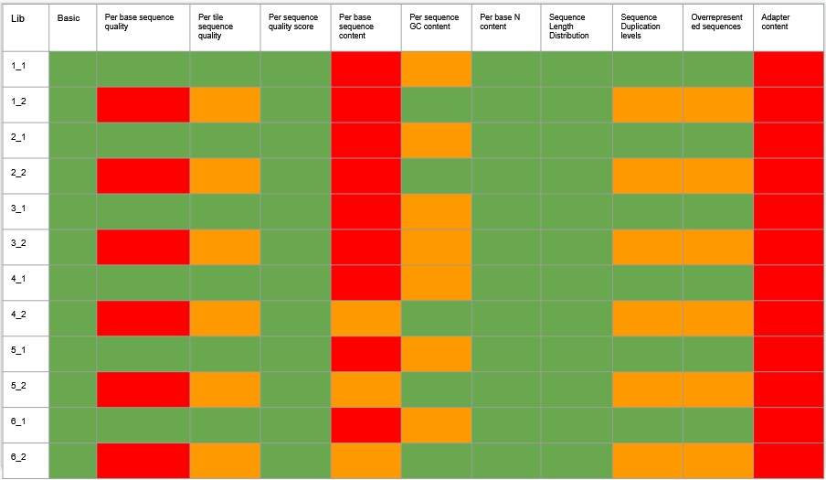
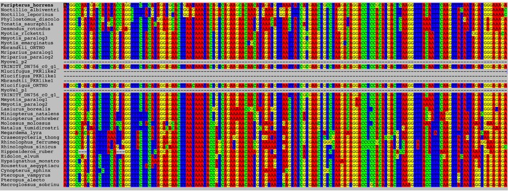
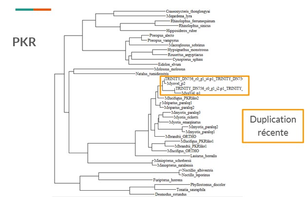
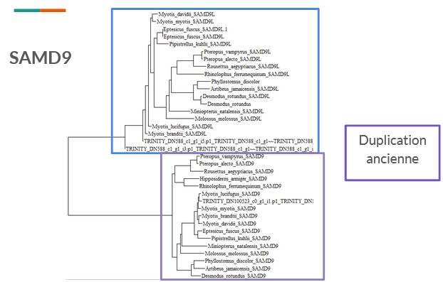
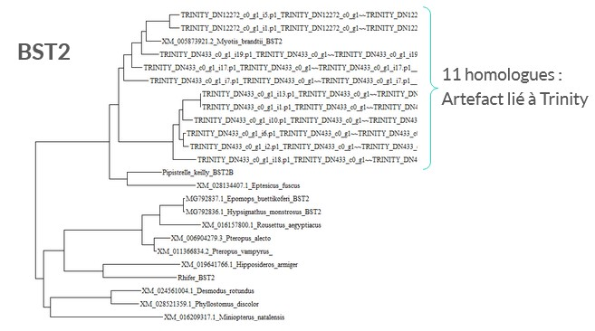

###TP bats NGS

read me du projet NGS chauve souris

ceci est un rajout en J1 pour tester le push

##J1 : Découverte de bash et construction d'un script fastqc

  Après tutoriels sur bash les fichiers ont été téléchargés sur le VM (Virtual Machine).
Les fichiers ont été rangés plus près de la racine pour simplifier les chemins
On se retouve donc avec les données de RNAseq brutes

  Avant de commencer à les assembler il convient de vérifier la qualité des données
On réalise donc un test de la qualité via le logiciel fastqc (voir le script dans 1_fastqc_trimomatic/scriptfastqc.sh)
Le logiciel a été lancé sur la nuit

##J2 : Résultats fastqc brutes et Trimmomatic

  Les résutats du fastqc ont été passés en revue, les principaux soucis sont : séquence de l'adaptateur pollue les données, 5 premiers nucléotides des fragments sont potentiellement riches en erreurs, on veut supprimer les séquences trop courtes  légende : tableau des résultats fastqc
  
  On prépare donc un script trimmomatic permettant de résoudre ces soucis en nettoyant les données. Ce logiciel créé de nouveaux fichiers fastq nettoyés. Les paramètres choisis ont été : HEADCROP=5 (5 premiers nucléotides des séquences supprimés)/ILLUMINACLIP=adapt.fasta (on supprime les parties de séquence trop similaire à l'adaptateur compris dans adapt.fasta)/MINLEN=100 (on supprime les séquences de moins de 100 nucléotides) (voir le script scripttrimomatic.sh dans 1_fastqc_trimomatic)
On laisse tourner Trimmomatic sur la nuit

##J3 Fastqc des données nettoyées et Trinity

  Les données obtenues par Trimmomatic sont réparties en paired et unpaired, seules les paired nous intéressent.
On a passé les fichiers obtenus dans fastqc pour vérifier si on a bien nettoyé les données : le problème de l'adaptateur a été nettoyé/ le problème de qualité des premiers nucléotides également, émergence d'une plus grande proportion de séquences dupliquées. Le nettoyage semble donc satisfaisant. (voir le script scriptfastqcclean.sh dans 1_fastqc_trimomatic)

  Trinity : attention FR-firststrand est inversé en RF pour SS_lib_type 
Préparation d'un script Trinity pour l'assemblage des fichiers des librairies. On construit donc des listes pour les Read 1 et pour les Read 2 qu'on donne à manger à Trinity. (voir le script scripttrinity.sh dans 2_assembly) 

  nohup :permet de lancer un script sans bloquer le terminal et de permettre aux scripts de s'exécuter en autonomie sur la VM,  tuto pour l'utiliser exemple "nohup ./scripttrinity.sh >& nohup.trinity.txt &" pour voir ce qu'on a lancé "ps" pour arrêter un script "kill "numéro du script"" pour voir où en est le script "tail nomdufichiertextnohup" pour arrêter la commande less appuyer sur la touche "q"
  
##J4 BLAST, Transdecoder
But de Transdecoder: analyse les données assemblées par trinity pour trouver les séquences codantes probables. Réalisation d'un script analysant les données avec Transcoder (voir le script scripttranscoder.sh dans 3_data_annotation). On utilise l'option single_best_only qui permet de ne garder que les plus longs ORFs pour chaque fragment d'ARNm.

But de BLAST: trouve des alignements locaux entre une séquence de référence et une séquence d'intérêt (voir le scriptblast.sh dans 3_data_annotation)

##J5 Corrections Transcoder, Blast
le script Blast renvoie réguliérement des fichiers vides. Après recherche de l'erreur avec le groupe et Marie on se rend compte que mes sorties Transdecoder sont très petites: erreur dans le script transdecoder qui donne à manger à Blast un fichier incomplet ?
Problème: Transdecoder commence à écrire et s'arrête au bout de 3,9Mb->problème d'espace sur le dique ? J'ai trouvé dans mes résultats de TRinity des fichiers temporaires de 50, 20 Giga chacun-> j'ai dû stopper en J3 le script en cours d'exécution et les fichiers temporaires n'ont pas été nettoyés! Suppression de ces fichiers car les résultats de Trinity ont été donnés et mis dans download/Trinity par les intervenants
Le script Transdecoder semble bien fonctionner maintenant->je recommence Transdecoder puis Blast
Blast ne fonctionne pas, en fait le Transdecoder.predict ne fait rien, cherche une solution.(mauvais fichier donné ? Oui en effet je ne donnais pas le résultat de transdecoder.predict mais de transdecoder.longORFs
Finalisation du script Blast permettant de construire un fichier fasta avec les homologues d'un gêne de myotis velifer et des autres espèces de chauve souris de référence

PRANK et PhyML : ne sont pas installés sur les VM, il faut donc les télécharger et configurer le chemin d'exécution sur la VM (voir scriptinstallations.sh dans 4_multi_sequence_alignment)
TRIMAL nécessaire pour utiliser PhyML et donc à installer aussi
Prank : réalisation d'un script permettant d'aligner les séquences obtenues après Blast puis conversion en fichier Phylip pour utilisation par PhyML. On teste différents paramètres pour trouver ceux peremettant le meilleur alignement. (voir scriptprank.sh dans 4_multi_sequence_alignment)
Les résultats de prank sont visualisés via le logiciel Seaview permettant de se rendre compte qu'il n'y a pas l'air d'avoir d'aberrations dans les alignements
 
légende : alignement multi-séquences pour la famille PKR visualisé dans Seaview

###J6
Rq:Trinity ne sait pas toujours distinguer 2 copies si elles sont trop proches (le cas pour BST2), pour régler le soucis il faudrait avoir un génome en référence pour mapper les données
Pour analyser les fichiers de trinity : grep ">" -c /ifb/data/mydatalocal/download/trinity/Trinity_RF.fasta donne le nombre de contigs, on en compte environ 400 000 ce qui est énorme
Pour analyser le fichier transdecoder : grep ">" -c ifb/data/mydatalocal/results/transdecoder_results/Trinity_RF.fasta.transdecoder.cds donne le nombre de gènes

Trimal: Le script pour la conversion du fichier de sortie de Prank au format Phylip via trimal est ajouté à scriptprank.sh dans 4_multi_sequence_alignment

Phyml: idem que pour trimal ajout à scriptprank.sh
Les arbres obtenus sont analysés et permettent d'émettre les hypothèses suivantes : un phénomène de duplication récente d'un gène PKR semble avoir lieu chez l'espèce myotis velifer. 
 
légende : arbre phylogénétique de la famille de gènes PKR chez les chauve-souris
Un phénomène de duplication ancien semble caractériser l'histoire évolutive de la famille de gènes SAMD9-SAMD9L. 
 
légende : arbre phylogénétique de la famille de gènes SAMD9-SAD9L chez les chauve-souris 
L'arbre de la famille de gènes BST2 fait apparaître 11 homologues chez l'espèce mytois velifer, cela semble être un artefact venant de trinity qui aurait identifié un trop grand nombre de transcrits.
 
légende : arbre phylogénétique de la famille de gènes BST2 chez les chauve-souris